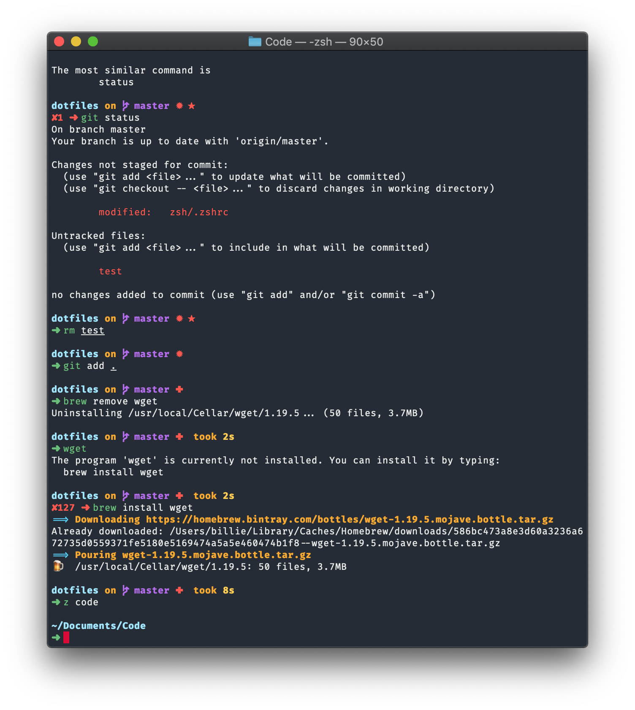

# Billie's Dotfiles



Mostly this is for backup purposes. It is all the important dotfiles to make the terminal look like above.

## Setup

### Color Scheme

Manually install the theme [DotGov](https://github.com/lysyi3m/macos-terminal-themes#dotgov).

### Install packages etc

To setup the home profile run

```
make sync-home
```

To setup the work profile run

```
make sync-work
```
